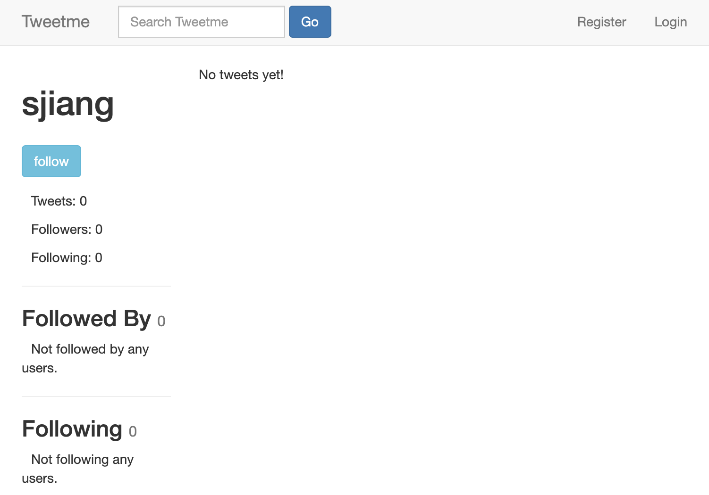

# Tweetme
A twitter like social microblogging platform based on Django and Django REST Framework

## Contents
- Login/Register
- Create/Edit/Delete tweets
- Search by tweet content or author name
- Follow/Unfollow
- User/Tweet detail page
- Browse your tweets and tweets from your following on your wall
- Browse all tweets and all users on one page
- Redirect all HTTP requests to HTTPS

## How to run
- git clone to your local
- install enviroment 
- run by 'python3 manage.py runserver'
- get it in local 'http://127.0.0.1:8000'

##Demo

